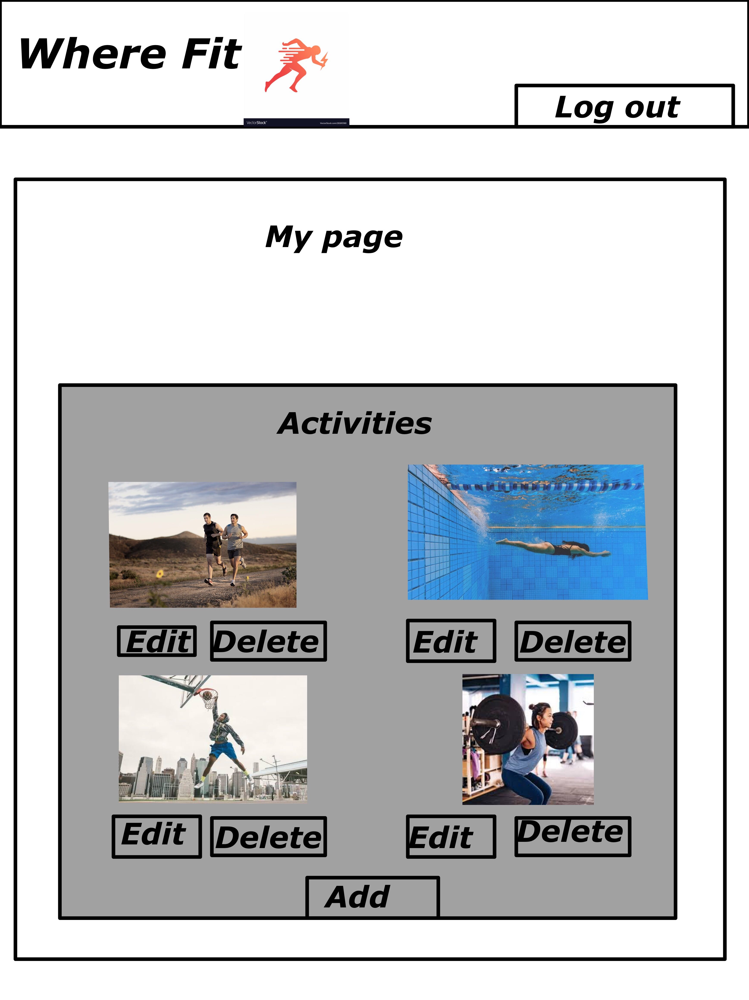

WHERE-FIT

(っ◔◡◔)っ ♥ Made by the  ♥

Track your activities based on location, by Jason, Steve, Hector, John

---
---

## Project Purpose:
Where-Fit is a website that uses location and fitness level to track and plan your activities. Pick and add the activities that interest you and we'll help you reach your fitness goals! 

## Features:
The features of our site includes naming of various activies based on  location, recommendations for different fitness levels, personal account that tracks your past activites. Can't find an activity? Just enter your location and find things going on around your area!

## Component Hierarchy

1. <App.js />
1a. <Header>
1b. <Footer>
2a. <Components/Activity />
2b. <Components/User />
2c. <Components/Location />

## ERD

### Wireframes
Welcome!

Come Register!

Come Log In!

Look at your profile!

Come check out what you can do!

Where are you located? We conform to anyone around the globe

## Challenges: 
-Populating accounts for the appication.
-SEED DATA INFO
-Group git 

## MVP 
-Allowing different user accounts.
-Tracking activites based on user information.
- Adding different locations.
- Adding different activites.

## Post-MVP 
-Geo-location!
-Carousel 

## Miscellaneous Technical Details

API Endpoint 

/ => Home Page, Locations, All Locations, Info Access(All locations for All users)

---

/:id => All Activity, info for selected locations(All Activities for specific Location)

/logon => User ID (id, Password, Token Id)

/register/ => id, password, token ID

---

From /register to /user

/user/:id/(edit/delete/location) (id, user id, tokens, list of my locations)

/user/:id/location/(new/:id/) (user tokens)

/user/:id/location/:id/(delete/edit) (location, token)

---

/user/:id/location/:id/activity (location Id, token, list of my activities for this location(All Info))

/user/:id/location/:id/activity/

